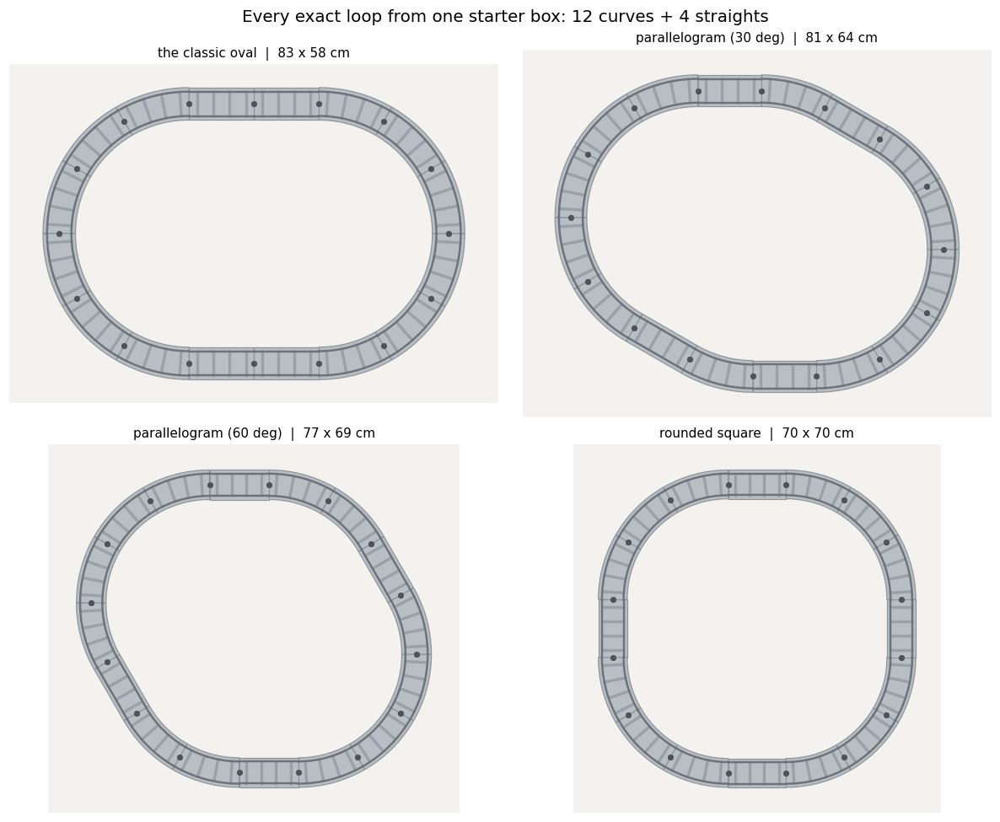
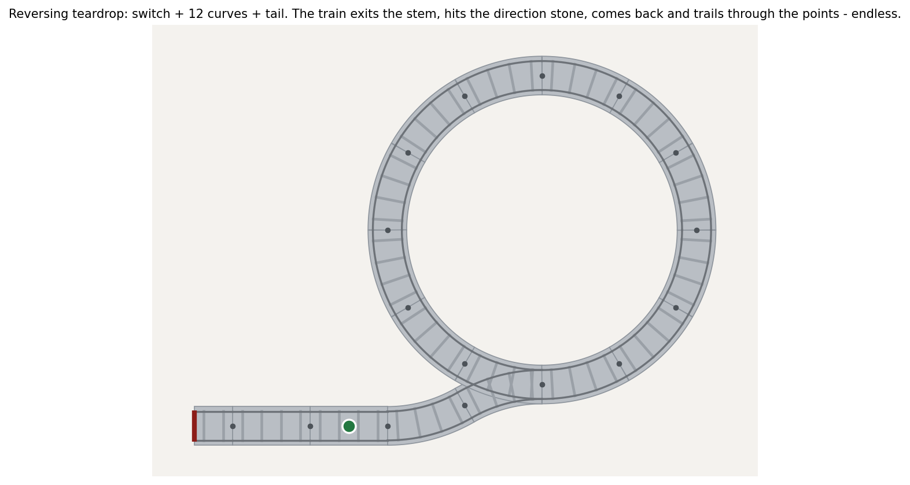
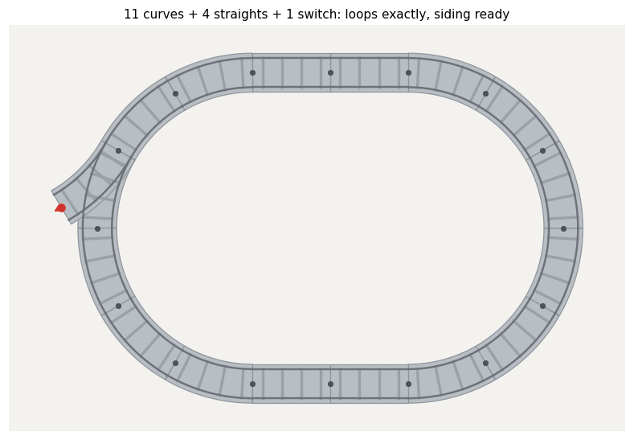
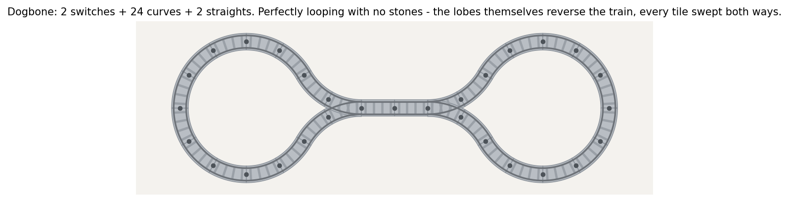

# duplotrain

Model LEGO® DUPLO® train track and find every layout that **loops nicely** — given the
pieces you actually own.

The mathematics that grew out of it — the lazy-point switch theorems and the
Lean 4 proof of the sharp state law `f(N) = min(2^N, N + 4)` — lives in
[`theory/`](theory/README.md).

```
duplotrain solve --curve 12 --straight 4 --use-all -o out
```



That picture is the *complete* answer for a starter box (12 curves + 4 straights): up
to rotation, reflection and starting point, exactly four closed layouts use the whole
box, and the solver proves it by exhaustion — in exact arithmetic, so "closed" means
*closed*, not "closed to within some epsilon".  (Drop `--use-all` and the sub-loops
that leave straights in the box are reported too.)

## Why exact arithmetic

A DUPLO curve turns 30° with a 256 mm centreline radius, and one curve advances exactly
one straight length (128 mm) while kicking sideways by `256 − 128·√3` mm. That `√3`
means loop-closure positions are irrational: test them with floats and a tolerance and
you will eventually bless a layout that is millimetres open, or reject one that is
perfect. All geometry here lives in the field **ℚ(√2, √3)** (four exact rational
coefficients per coordinate), headings live on a 24-step lattice of 15°, and a loop is
closed if and only if the end pose *equals* the start pose.

Real DUPLO joints do have designed-in play (~1 mm each), and some classic builds rely
on it — the famous `R,R,L,L` lane-change is 4.59 mm short of its nominal length. Pass
`--slop 6` and the solver will admit such **forced fits** too, always reporting exactly
how many millimetres the joints must absorb. It never mislabels them as exact.

## The pieces

Geometry for the modern light-grey system (2018+, sets 10874 / 10875 / 10882), sourced
from measured surveys ([Cailliau](https://www.cailliau.org/en/Alphabetical/L/Lego/Duplo/Train/Rails/Dimensions/),
[duplo-schienen.de](http://www.duplo-schienen.de/lego-duplo-schienen-geometrische-regeln.html),
[onemetre.net](https://www.onemetre.net/OtherTopics/Duplo/Track%20dims/DuploTrack.htm))
and the LDraw part library:

| id               | part    | geometry                                                  |
| ---------------- | ------- | --------------------------------------------------------- |
| `straight`       | 6377    | 128 mm (8 studs) connection pitch                          |
| `curve`          | 6378    | 30°, R = 256 mm; 12 make a 576 mm circle                   |
| `switch`         | 51943c01| left + right 30°/R256 branches off one stem (LDraw-exact); no straight route |
| `crossing`       | 6376    | two 128 mm straight runs crossing at their midpoints, 60°  |
| `level_crossing` | 6391    | one straight under a 160 × 160 mm road plate (16 mm end overhang — two of them refuse to mate) |
| `ramp`           | 6392    | 320 mm run rising 57.6 mm (3 bricks)                       |
| `span`           | 6393    | 192 mm arch rising a further 19.2 mm to the 76.8 mm crest  |
| `buffer`         | 35967   | 64 mm track-end bumper; its far face is sealed and can never mate |
| `slope`          | 35966   | 256 mm "slight slope" from 10875 (rise ~5.6 mm, unverified) |

Connectors are genderless (a jigsaw tab **and** socket at every end), so any end mates
with any end and one physical curve serves as both the left and the right turn — the
model gets that for free by letting pieces be entered from either port.

These numbers were settled by parsing the LDraw part files and BlueBrick's measured
connection library, cross-checked against part weights, photographs and
duplo-schienen.de's combination rules (BrickLink's stud dimensions for track parts are
demonstrably wrong and were rejected). The one soft spot left is the bridge's vertical
split — derived from brick-integer constraints and part heights rather than a published
figure. Override any piece — or add entirely new ones — with a JSON catalogue, no code
changes:

```json
{ "pieces": [ { "id": "ramp",
    "name": "Bridge ramp (my callipers)", "category": "bridge", "width": 64,
    "paths": [ { "segments": [ { "type": "ramp", "run": 320, "rise": 60 } ] } ],
    "port_names": ["low", "high"] } ] }
```

```
duplotrain solve --catalog my-measurements.json --curve 12 --ramp 2 --span 2 ...
```

Lengths may be plain numbers, exact fractions (`"384/5"`), field elements
(`{"alg": [a, b, c, d]}` = `a + b√2 + c√3 + d√6`), or arc chords
(`{"chord": {"radius": 256, "degrees": 30}}`).

## Install & use

Python ≥ 3.12. From a checkout:

```
pip install -e .[dev]        # click + rich + matplotlib + pytest
```

CLI:

```
duplotrain pieces                                     # the catalogue
duplotrain sets                                       # known boxed sets
duplotrain solve --set 10874 --set 10882 -o out       # "we own these boxes"
duplotrain solve --curve 12 --straight 4 --switch 2 -o out
duplotrain solve --inventory mybox.json --slop 5 -o out
duplotrain check out/loop_01.json                     # closure report
duplotrain render out/loop_01.json -o picture.png
duplotrain gui                                        # interactive designer
duplotrain demo                                       # the classic oval
```

`--set` knows the 2018 wave (10874 Steam Train, 10875 Cargo Train, 10872 Bridge &
Tracks, 10882 Track pack) with verified per-set piece counts — repeat a flag to own a
set twice. Sets also contribute their **action stones** (below).

## Action stones and reversing loops

The coloured inserts that clip onto a straight are modelled as accessories: red stop,
yellow horn, blue refuel, white lights, and — the interesting one — **green
direction-change**. A layout doesn't have to be a plain closed loop to run forever:



With `reversing_loops` enabled (`--reversing`, on automatically when your `--set`s
include the green stone, or the checkbox in the GUI) the solver also proposes
**teardrops**: the walk closes into the switch's *other branch* instead of back on
itself. The train always exits through the stem, bounces off the direction stone on
the tail, comes back in and trails through the points — endless running from one
switch and twelve curves, no full circle of spare track required. Exactly three
distinct teardrop shapes exist for switch + 12 curves; the solver proves it.

In the GUI, stones are armed from their own palette and clipped onto straights with a
click; buffers cap open ends (their bumper face draws as a bar and is not clickable);
layouts count as *closed* when every real connector is mated — a buffered siding is
finished, not dangling.

## The designer GUI

**Browser build:** the editor can run fully client-side using the identical Python
engine under Pyodide. `webapp/build.py` produces the static bundle; nothing leaves
the browser.

`duplotrain gui` opens a local track editor in your browser (standard library server,
nothing to install). Because DUPLO only ever connects on the exact lattice there is no
freeform dragging: arm a piece variant in the palette, click a red open-end arrow and
it snaps on. Junction stubs are clickable ends like any other, piece counts come from
your editable inventory, and **Close the loop** hands the layout to the completion
solver — candidates are listed with their gap (exact or forced), preview as ghosts on
hover, and apply with a click. Export/import round-trips the same exact-geometry JSON
the CLI uses.

The same completion search is available as a library call — "I built this much by
hand, close it for me":

```python
result = solve({"curve": 18, "straight": 8}, pieces,
               SolverConfig(min_pieces=1, slop=2.0),
               base=my_layout)          # optionally grow_from=/close_onto= ends
```

It keeps every placed piece where it is, grows from one open end, and reports every
way to reach the other — respecting collisions with the existing track and re-entering
its open switch branches when they help.

`solve` prints a ranked table (exactness, box usage, compactness, squareness, variety,
dangling-branch penalty — weights overridable in `duplotrain.scoring`) and writes a
PNG + JSON per kept layout. Layout JSON stores frames as exact coefficients, so a
reloaded layout still passes the exact closure test.

Library:

```python
from duplotrain import default_catalog, solve, SolverConfig, render_layout

pieces = default_catalog()
result = solve({"curve": 12, "straight": 4, "switch": 1}, pieces,
               SolverConfig(max_results=50))
best = result.solutions[0]        # .layout, .exact, .gap, .open_stubs
render_layout(best.layout, "loop.png")
```



## Driving, and the looping ladder

Geometry closing is necessary, not sufficient: switches have *state*. `duplotrain.drive`
simulates a train with real points semantics — a **facing** move (in at the stem)
follows the tongue; a **trailing** move (in through a branch) pushes through and
**forces the tongue to the branch it came from**, like the real unsprung DUPLO points.
Direction stones bounce the train once per pass; stop stones park it; buffers and open
ends end the run. Every run is provably periodic (finite state), so
`classify()` decides, by exhaustive simulation over every starting position, direction
and initial tongue setting, where a layout sits on the ladder:

| level | meaning |
| --- | --- |
| **locally looping** | some placement runs forever |
| **looping** | every placement runs forever |
| **completely looping** | …and every run covers the whole track |
| **perfectly looping** | …sweeping every tile in both directions, infinitely often |

(`duplotrain classify layout.json` prints the verdict and a counterexample start.)

Findings the simulator proves about real DUPLO:

- Any reachable open end or buffer admits a doomed start (bounce off the tip, or park
  against the bumper), so everything from *looping* up requires a fully mated layout.
  Teardrops are therefore *locally* looping only — wonderful, but keep the toddler
  from placing the loco at the very tip.
- A plain loop is *completely* but never *perfectly* looping: runs are one-way.
  Clip one green direction stone anywhere on it and it becomes **perfect** — every
  run ping-pongs, sweeping everything both ways.
- Teardrops come in two flavours: **stem-tailed** (the classic — every pass trails
  the points, the tongue alternates, the train alternates lobes) and **branch-tailed**
  (a one-way trap that absorbs the train into its circuit). `is_stem_tailed()` tells
  them apart; only the first composes further.
- Join two stem-tailed teardrops through their tails and you get the **dogbone** —
  perfectly looping with *no stones at all*: the lobes themselves reverse the train.



## Isomorphism and finding all perfect tracks

Two layouts count as the same when their track centrelines are congruent curves in
space (rotations, translations, reflections; `z` included, so bridges distinguish) —
which straight carries the stone, or whether a level crossing stands in for a plain
straight, doesn't change the curve. `congruence_key()` canonicalises the sampled
centreline over the 24 lattice rotations × reflection, so non-isomorphic hunting is a
set of keys:

```python
from duplotrain import default_catalog, find_perfect_loops, SolverConfig

pieces = default_catalog()
perfect = find_perfect_loops({"curve": 12, "straight": 4}, pieces,
                             SolverConfig(use_all_pieces=True, max_results=100))
# -> 4 non-isomorphic perfectly looping tracks (oval, two parallelograms,
#    rounded square -- each with one direction stone clipped on)
```

With today's pieces, perfection has exactly three known sources: a closed loop plus a
direction stone; a **reversing terminator** (direction stone at a buffer face — every
approach bounces off the wall) capping the ends of otherwise-open track (shuttles,
capped teardrops); or reversing *topology* (dogbones — build them with
`make_dogbone(pick_stem_tailed(solutions, pieces), pieces)`). Everything else tops out
lower on the ladder, and `classify` will tell you why, with the exact doomed start.

**Exhaustive network search.** `enumerate_networks()` goes beyond single driving
loops: it enumerates every *closed network* — all connectors mated or sealed,
passing-loop and multi-cap topologies included — by always extending the canonically
smallest open end (attach, or join two ends that mate), with end-aware collision
handling and congruence dedup. `find_perfect_networks()` then tries the sensible
direction-stone placements (buffer faces are forced; one mid-loop stone otherwise)
and classifies each, so for bounded sizes the question "what are ALL the perfectly
looping networks from this box?" is answered by proof, not by taste. Costs are
honest: exhaustion is practical to roughly a dozen pieces (a 14-piece hunt is a
few minutes); beyond that, compose constructively and verify with `classify`.

The switch dynamics yields a little theorem the machine confirms by exhaustion: a
dead-end cap **reflects** a train back through the branch it came from, so a trailing
pass re-aims the tongue at that same branch and a facing return retraces it — caps
keep the tongue *sticky*. Only a lobe (branch-to-branch loop) *alternates* the
tongue. Hence a 3-armed star of capped arms ping-pongs between two arms forever
(looping, never completely), and **no perfect one-switch network exists without
curves** — checked over all 27 closed candidates. Perfection needs rotation
somewhere: a lobe, or a stone in a ring.

## How the solver works

Depth-first search that walks track outward from an anchored origin, over the
geometrically distinct traversals of each piece type (a straight contributes one move,
a curve two — its left and right readings), trying homeward moves first so small gaps
close promptly. It prunes, conservatively: headings that the remaining pieces cannot
swing back to the anchor's, positions they cannot reach home from, placements that
overlap existing track (respecting elevation, so a sufficiently high bridge
legitimately crosses over), and joints where two overhanging road plates would claim
the same floor. Switches drop *open stubs* which the walk may later re-enter exactly —
figure-eights and re-joining branches emerge from that rule alone. Found loops are
deduplicated by a canonical signature invariant under rotation, reversal **and
reflection** — the mirror image is generated explicitly per piece from its geometry,
since walking a chiral loop backwards is not its mirror image.

Elevation is modelled (ramps carry `z`; closure requires returning to ground), and the
collision clearance defaults to 120 mm — a DUPLO loco is ~100 mm tall, and the stock
bridge crests at 76.8 mm, which is why the real one only passes toy cars underneath.

**Arithmetic engines.** Exactness doesn't require Fractions: every real piece turns in
30° steps and measures in twentieths of a millimetre, so positions live in the scaled
cyclotomic ring (1/20)·ℤ[e^{iπ/6}], where rotation is an *integer* 4×4 map. The solver
compiles the problem for this integer lattice engine automatically (~6× faster:
1.8k → 10k nodes/s natively; it's what makes the browser build usable) and falls back
to the general ℚ(√2,√3) field for anything off-grid — a user piece on the 45° lattice,
say. Conformance tests run every solver mode on both engines and require identical
solutions. If far bigger searches ever matter (v2 multi-cycle at scale), the same seam
is where a Rust core would slot in.

**Current limits worth knowing:**

- The solver finds *driving loops* — one closed train circuit. A passing loop (both
  switch branch-pairs connected) is not a single circuit and needs the planned
  multi-cycle search; today the second track shows up as two dangling stubs. (The
  completion solver will happily close a hand-built passing loop's siding, though.)
- With the measured crossing geometry, no figure-eight closes within 6 mm from 12–16
  curves (± straights): the solver instead uses the crossing straight-through with its
  other route dangling. Blame the lattice, not the box.
- Collision checking is sampled discs along centrelines: exact-touch parallel tracks
  are legal, sub-2 mm grazes may slip through.

## Tests

```
python -m pytest                  # everything
python -m pytest -m "not slow"    # skip the ~2 min full-enumeration proofs
```

The suite covers the number field, the pose lattice, piece derivation, the documented
geometric identities (the `L,R,R,L` snake equals four straights exactly; `R,R,L,L`
misses by exactly `448 − 256√3` ≈ 4.59 mm), serialisation round-trips, collision
regressions, the CLI, the GUI's HTTP API, completion mode, and solver ground truths
(12 curves make exactly one circle; the starter box makes exactly four shapes; 12
curves + 6 straights make exactly 18; a deliberately stretched piece closes only as a
forced fit reporting exactly its 2 mm gap).

---

*Not affiliated with the LEGO Group. LEGO and DUPLO are trademarks of the LEGO Group.*
